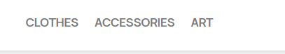
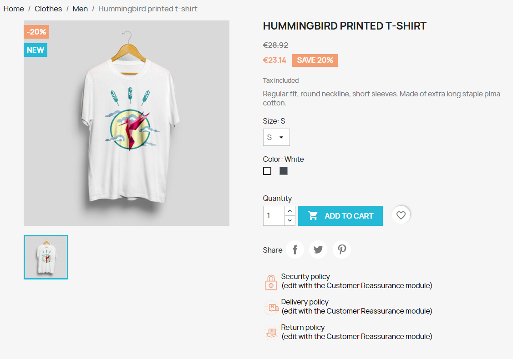
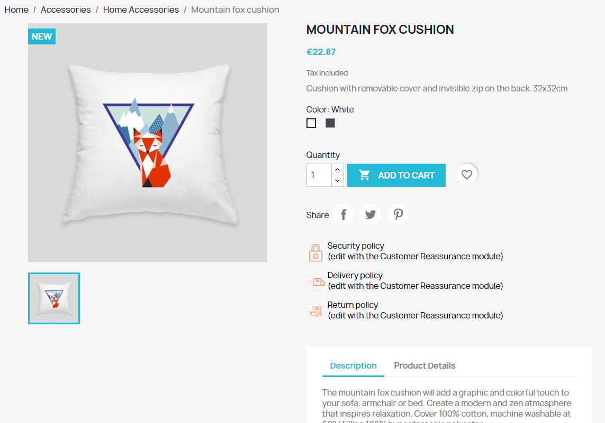
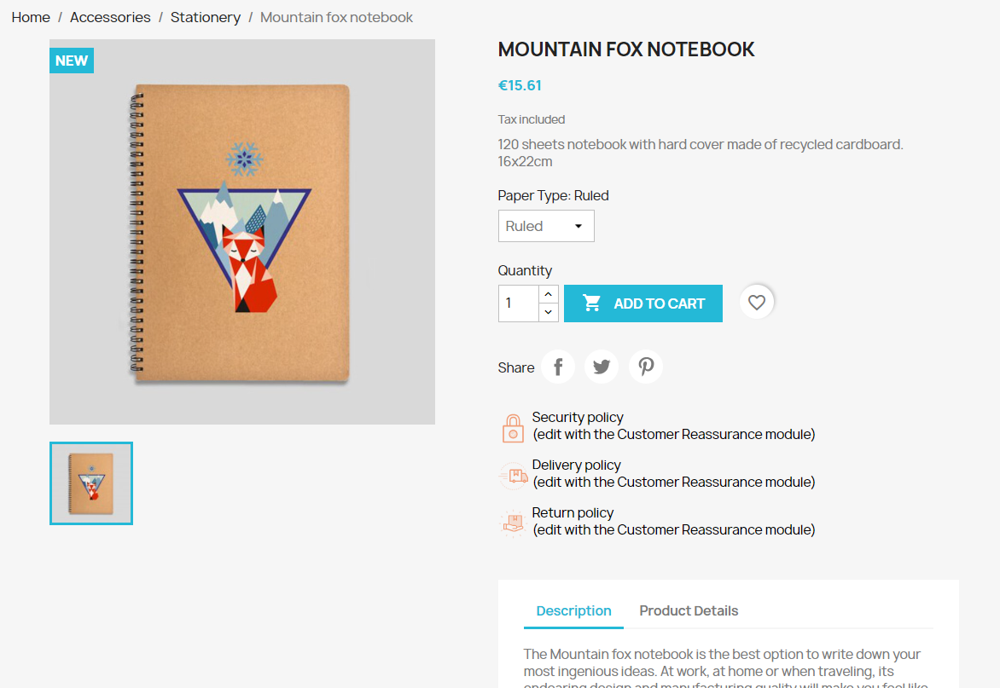
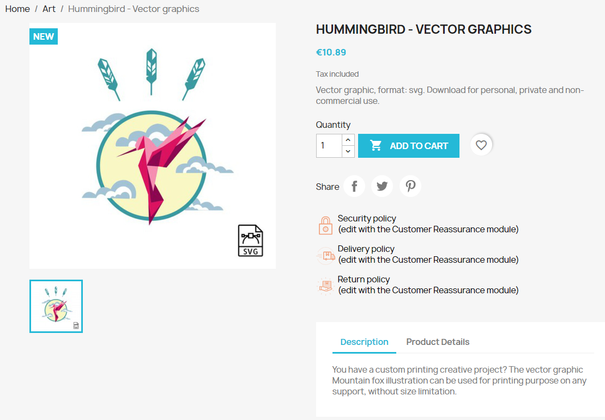
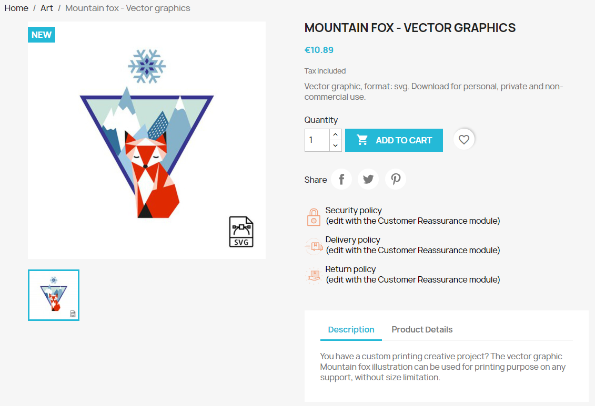

# PrestaShop E-commerce Platform Setup

## Table of Contents
1. [Overview](#overview)
2. [Project Goals](#project-goals)
3. [Setup Instructions](#setup-instructions)
4. [Configuration Details](#configuration-details)
5. [Features](#features)
6. [Categories and Products](#categories-and-products)
7. [Evaluation](#evaluation)
8. [Contact](#contact)

## Overview

This project uses Docker to deploy a PrestaShop e-commerce platform with a MySQL database.

## Project Goals

The goal of this project was to create a functional e-commerce store with the following characteristics:

- A comprehensive product catalog.
- Clear descriptions, prices, and high-quality images for each product.
- A user-friendly design and navigation.
- Functionality for users to write product reviews.

## Setup Instructions

1. **Clone the Repository**

    ```bash
    git clone https://github.com/PovilasUrb/Prestashop_on_Docker
    cd Prestashop_on_Docker
    ```

2. **Start the Services**

    ```bash
    docker-compose up
    ```

3. **Access PrestaShop**

    Open your web browser and go to `http://localhost:8080` to access the PrestaShop frontend.

## Configuration Details

The setup includes two main services:

- **MySQL Service:** Provides the database for PrestaShop.
- **PrestaShop Service:** Hosts the e-commerce platform.

These services are connected through a Docker network named `prestashop_network`.

## Features

### Product Catalog

- **Product Listings:** The catalog features a variety of products organized into categories.
- **Detailed Descriptions:** Each product includes a clear description, price, and high-quality images.

### Design and Navigation

- **User-Friendly Design:** The chosen template ensures easy navigation and a visually appealing layout.

### Product Reviews

- **Review Functionality:** Users can write reviews for products, enhancing the interactive experience.

### Additional Configuration

- **Optimized Settings:** The environment variables are configured for optimal performance with appropriate memory and file size limits.

## Categories and Products

The store is organized into several categories, each containing a variety of products. Below is an overview of the current categories and products:



1. **Category 1: Clothes**
    - **Products:**
      - 

2. **Category 2: Accesories**
    - **Products:**
      - 
      - 

3. **Category 3: Art**
    - **Products:**
      - 
      - 

Each category contains a range of products with detailed descriptions, prices, and high-quality images.
